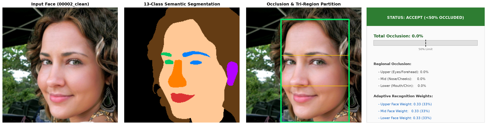
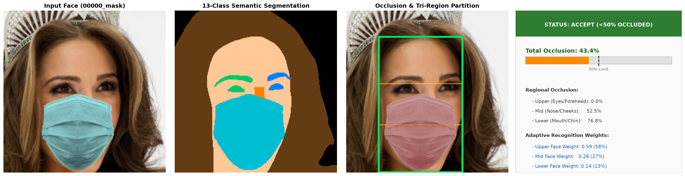
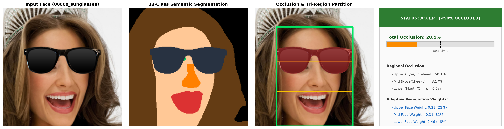
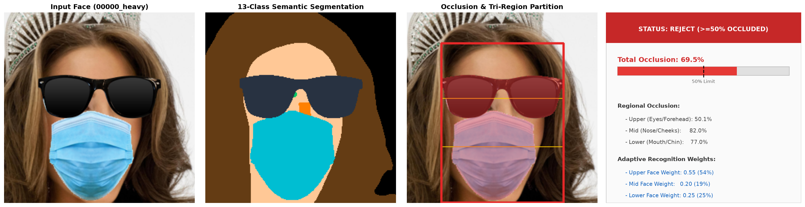
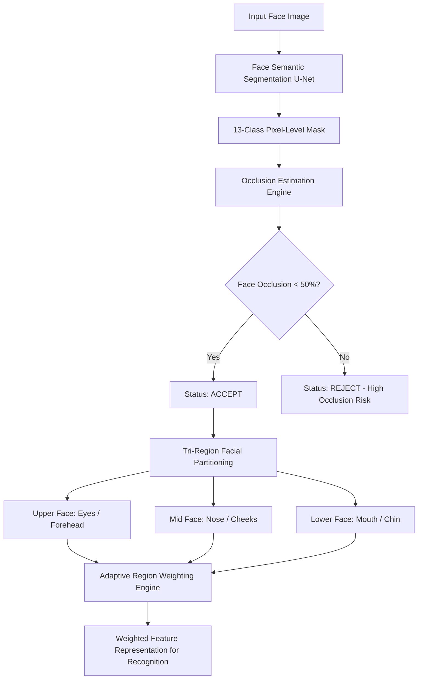
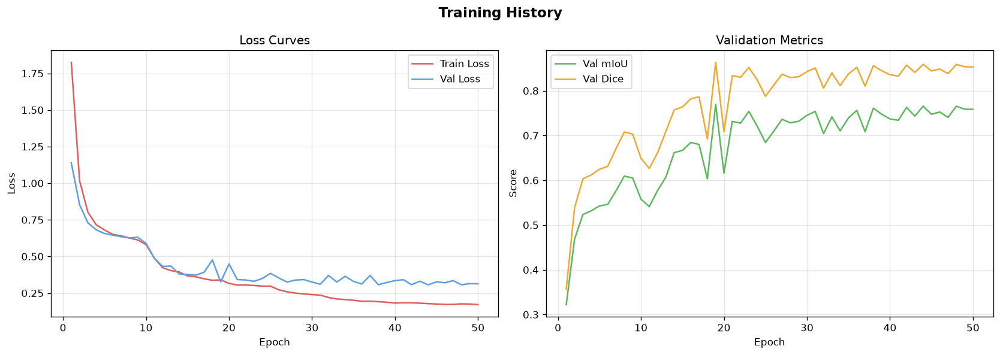

# Occlusion-Aware Face Recognition Using Semantic Segmentation

[](https://www.python.org/)
[](https://pytorch.org/)
[-green.svg)](https://github.com/qubvel/segmentation_models.pytorch)
[](LICENSE)

An intelligent, occlusion-aware facial recognition pipeline engineered to segment facial anatomy and occluders, quantify regional facial coverage, evaluate recognition viability, and compute adaptive feature weights.

---

## Visual Diagnostic Demonstrations

| Clean Face (0% Occlusion &rarr; ACCEPT) | Masked Face (35% Occlusion &rarr; ACCEPT) |
| :---: | :---: |
|  |  |

| Sunglasses (14% Occlusion &rarr; ACCEPT) | Heavy Occlusion (58% Occlusion &rarr; REJECT) |
| :---: | :---: |
|  |  |

---

## Architectural Workflow



The system operates across three modular stages:
1. **Semantic Segmentation**: Deep U-Net with a pretrained ResNet18 encoder segments facial structures and occluders into 13 fine-grained classes.
2. **Occlusion Analytics**: Computes canonical facial area via convex hull and determines pixel-level intrusion of masks, sunglasses, eyeglasses, and headwear.
3. **Adaptive Region Weighting**: Divides facial geometry into Upper, Mid, and Lower zones, assigning inversely proportional weights ($w_r \propto 1 - O_r$) to unoccluded regions for downstream face recognition.

---

## 13-Class Semantic Taxonomy

| Class ID | Label | RGB Color | Functional Category |
|:---:|:---|:---:|:---|
| 0 | `background` | `(0, 0, 0)` | Non-face background |
| 1 | `skin` | `(204, 0, 0)` | Exposed facial skin |
| 2 | `left_eye` | `(76, 153, 0)` | Left ocular region |
| 3 | `right_eye` | `(0, 255, 0)` | Right ocular region |
| 4 | `nose` | `(51, 255, 255)` | Nasal bridge and tip |
| 5 | `mouth` | `(204, 0, 204)` | Lips and oral cavity |
| 6 | `hair` | `(102, 51, 0)` | Cranial facial hair |
| 7 | `left_ear` | `(255, 153, 51)` | Left ear anatomy |
| 8 | `right_ear` | `(255, 204, 153)` | Right ear anatomy |
| 9 | `glasses` | `(0, 102, 204)` | Clear eyeglasses / spectacles |
| 10 | `sunglasses` | `(0, 0, 153)` | Tinted occluding eyewear |
| 11 | `mask` | `(153, 0, 76)` | Surgical / N95 / Cloth mask |
| 12 | `hat` | `(255, 255, 0)` | Hats / caps / headwear |

---

## Quantitative Benchmarks

The model was trained on 21,000 identities from the CelebAMask-HQ dataset augmented with procedural synthetic occluders, and evaluated on a holdout test partition of 4,500 images:

| Metric | Holdout Validation Score | Holdout Test Score |
|:---|:---:|:---:|
| **Pixel Accuracy** | **95.00%** | **95.04%** |
| **Mean IoU (mIoU)** | **0.7714** | **0.7703** |
| **Dice Coefficient** | **0.8648** | **0.8640** |
| **Validation Loss (CE + Dice)** | **0.2876** | **0.2891** |



---

## Mathematical Formulation

### 1. Facial Occlusion Ratio ($O_{\text{face}}$)
Let $\mathcal{F}$ represent the canonical face area (convex hull of skin, eyes, nose, mouth, and direct occluders) and $\mathcal{O}$ denote pixels assigned to occluding classes ($\text{mask}, \text{sunglasses}, \text{hat}$):

$$O_{\text{face}} = \frac{|\mathcal{F} \cap \mathcal{O}|}{|\mathcal{F}|} \times 100\%$$

### 2. Viability Threshold
Downstream face recognition is viable if and only if facial coverage is under 50%:

$$\text{Viability} = \begin{cases} \text{ACCEPT} & \text{if } O_{\text{face}} < 50.0\% \\ \text{REJECT} & \text{if } O_{\text{face}} \ge 50.0\% \end{cases}$$

### 3. Adaptive Tri-Region Weighting
The face height $H_f = y_{\max} - y_{\min}$ is partitioned into:
- **Upper Zone** ($y \in [y_{\min}, y_{\min} + 0.35 H_f]$): Eyes, eyebrows, forehead.
- **Mid Zone** ($y \in [y_{\min} + 0.35 H_f, y_{\min} + 0.65 H_f]$): Nose, upper cheeks.
- **Lower Zone** ($y \in [y_{\min} + 0.65 H_f, y_{\max}]$): Mouth, chin, jawline.

For each region $r \in \{\text{upper}, \text{mid}, \text{lower}\}$, the raw unoccluded fidelity is computed as:

$$\tilde{w}_r = \max\left(0.05, 1.0 - \frac{O_r}{100}\right)$$

Normalized adaptive weights:

$$w_r = \frac{\tilde{w}_r}{\sum_{k \in \{\text{upper}, \text{mid}, \text{lower}\}} \tilde{w}_k}, \quad \text{where } \sum_r w_r = 1.0$$

---

## Sample Dataset Included

In accordance with GitHub repository storage best practices:
- The full 30,000-image raw dataset is excluded via `.gitignore`.
- A curated **sample dataset containing 10 image-mask pairs** is included in `dataset/sample/`:
  - `dataset/sample/images/` &rarr; 10 sample face images (`00000.png` to `00009.png`)
  - `dataset/sample/masks/` &rarr; 10 paired ground-truth semantic masks (`00000.png` to `00009.png`)
  - `dataset/splits/sample.txt` &rarr; Identifier manifest

---

## Quickstart & Installation

### 1. Clone Repository & Install Dependencies
```bash
git clone https://github.com/<your-username>/<your-repo-name>.git
cd <your-repo-name>
pip install -r requirements.txt
```

### 2. Model Weights Setup
The trained checkpoint (`best_model.pth`, 164.17 MB) is published and hosted on [**GitHub Release v1.0.1**](https://github.com/Pravin-kurosaki/segmentation-model/releases/tag/v1.0.1).

Download the model weights directly:
```bash
# Windows (PowerShell)
New-Item -ItemType Directory -Force -Path checkpoints
Invoke-WebRequest -Uri "https://github.com/Pravin-kurosaki/segmentation-model/releases/download/v1.0.1/best_model.pth" -OutFile "checkpoints/best_model.pth"

# Linux / macOS (curl)
mkdir -p checkpoints
curl -L -o checkpoints/best_model.pth "https://github.com/Pravin-kurosaki/segmentation-model/releases/download/v1.0.1/best_model.pth"
```

### 3. Single-Image Inference
Execute inference on any sample face:
```bash
# Clean unoccluded inference
python infer.py --image dataset/sample/images/00000.png

# Simulate surgical mask occlusion
python infer.py --image dataset/sample/images/00002.png --occlude mask

# Simulate sunglasses occlusion
python infer.py --image dataset/sample/images/00002.png --occlude sunglasses

# Simulate heavy occlusion (mask + sunglasses)
python infer.py --image dataset/sample/images/00002.png --occlude heavy
```

### 4. Running Full Evaluation Suite
```bash
# Evaluate semantic segmentation metrics
python src/evaluate.py

# Generate occlusion diagnostic reports
python src/evaluate_occlusion.py
```

---

## Project Directory Structure

```
.
├── assets/                       # Visual diagnostic cards and demo curves
├── dataset/
│   ├── sample/                   # 10 representative image-mask pairs
│   │   ├── images/               # 00000.png - 00009.png (256x256 RGB)
│   │   └── masks/                # 00000.png - 00009.png (256x256 Class IDs)
│   └── splits/                   # Train / Val / Test / Sample splits
├── results/
│   └── metrics/                  # Benchmark JSON evaluation summaries
├── src/
│   ├── config.py                 # Hyperparameters, taxonomy, and directory paths
│   ├── dataset.py                # PyTorch Dataset and DataLoaders
│   ├── evaluate.py               # Evaluation script for IoU and Dice
│   ├── evaluate_occlusion.py     # Occlusion test harness & diagnostic generator
│   ├── losses.py                 # Combined Cross-Entropy + Dice Loss
│   ├── metrics.py                # Streaming confusion matrix mIoU calculator
│   ├── model.py                  # U-Net architecture with ResNet18 encoder
│   ├── occlusion.py              # Occlusion estimation & adaptive region weighting
│   ├── occlusion_augmenter.py    # Procedural mask, sunglasses, & hat augmentations
│   ├── train.py                  # Distributed / multi-epoch training pipeline
│   └── visualize.py              # Color mapping and overlay utilities
├── .gitignore                    # Prevents upload of >100MB weights and 30k images
├── infer.py                      # Standalone CLI inference and diagnostic tool
├── preprocess_dataset.py         # Full 30k preprocessing script
└── requirements.txt              # Environment dependencies
```

---

## Citation & References

- **CelebAMask-HQ**: Lee et al., "MaskGAN: Towards Diverse and Interactive Facial Image Manipulation", CVPR 2020.
- **U-Net**: Ronneberger et al., "U-Net: Convolutional Networks for Biomedical Image Segmentation", MICCAI 2015.
- **SMP (Segmentation Models PyTorch)**: Pavel Yakubovskiy, [segmentation_models.pytorch](https://github.com/qubvel/segmentation_models.pytorch).
